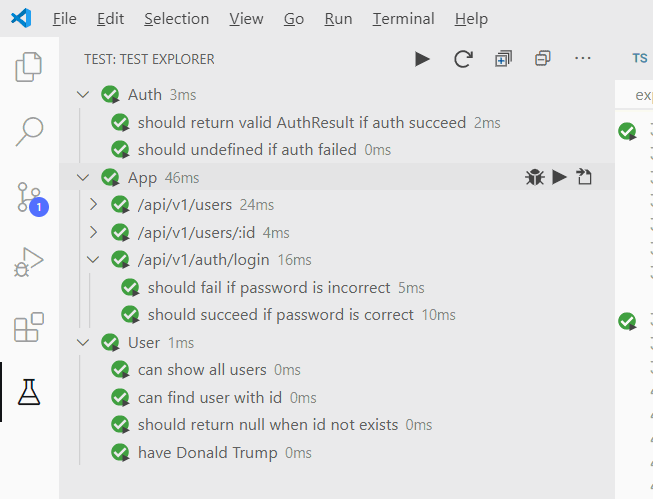
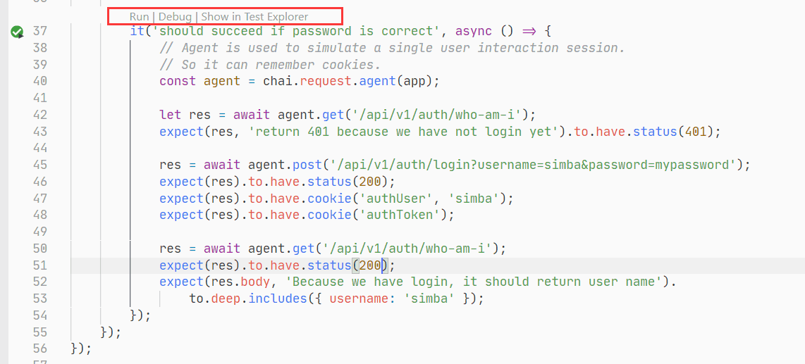

# Demo Project of Node.js + Express + TypeScript + Mocha in VSCode <!-- omit in toc -->

This project is a minimal set of files which enables creating backend server with:

- [Node.js](https://nodejs.org/en/) and [ExpressJS](https://expressjs.com/) - Popular backend solution.
- [TypeScript](https://www.typescriptlang.org/) - A language extends from JavaScript. It adds a lot of essential features(such as strong type)
  for enterprise level projects.

If you just starting learning backend development, I hope this project can make things easier for you.
I will try to explain every bits in the comments of the code.

- [Point of interest](#point-of-interest)
- [Prepare the Project](#prepare-the-project)
- [Start the Server](#start-the-server)
- [Start Testing](#start-testing)
- [Deploy with Docker](#deploy-with-docker)
- [Reference](#reference)
- [Change Log](#change-log)

## Point of interest

1. A enjoyable VSCode developing environment.
2. Complete testing: unit test + web server test.
3. Deploy server with docker.

## Prepare the Project

1. Install Node.js
2. Install VSCode

   - Install VSCode Extension: Mocha Test Explorer

3. Clone the project

   ```
   $ git clone git@github.com:kingsimba/express-typescript-mocha-vscode.git
   ```

4. Install dependent node packages

   ```
   $ cd express-typescript-mocha-vscode
   $ npm install
   ```

5. Open with VSCode

   ```
   code .
   ```

## Start the Server

1. Press F5 to run & watch.

   It's configured in ".vscode/launch.json" file.

2. Open browser and try the following URLS

   ```
   GET http://localhost:8080
   GET http://localhost:8080/api/v1/users
   GET http://localhost:8080/api/v1/users/1
   GET http://localhost:8080/api/v1/users/999
   GET http://localhost:8080/api/v1/docs/sample.html
   POST http://localhost:8080/api/v1/auth/login?username=simba&password=mypassword
   POST http://localhost:8080/api/v1/auth/logout
   ```

3. Play with code

   The server will restart automatically when you save any file.
   (Modify "hello world" to "HELLO" for example)
   But you need to refresh the page manually to see the new result.

4. Another way to compile & watch: Press Ctrl+Shift+B

   It's configured in '.vscode/tasks.json'.

## Start Testing

Warning: Please make sure the serve is shutdown before testing. Press Shift+F5 to stop the server.

And the server is tested with:

- [Mocha](https://mochajs.org/) - the fun, simple, flexible JavaScript test framework.
- [Chai](https://www.chaijs.com/) - a BDD / TDD assertion library.
- [Mocha Test Explorer](https://marketplace.visualstudio.com/items?itemName=hbenl.vscode-mocha-test-adapter) - A VSCode plugin to run tests within VS Code.

There are 3 ways to run the tests.

1. Run from Test Explorer.

   

   Optionally, enable "auto run" and modify any of the \*.spec.ts. When saved, the corresponding tests will run.

2. Click "run" or "debug" in the inlined code.

   

3. Use "npm test"

   ```
   $ npm test

   > express-typescript@1.0.0 test C:\Users\kingsimba\Documents\github\express-typescript-mocha-vscode
   > mocha src/**/*.ts --require='ts-node/register/transpile-only'

   server started at http://localhost:8080


   Auth
      √ should return valid AuthResult if auth succeed
      √ should undefined if auth failed

   App
      /api/v1/users
         √ return an array of users
      /api/v1/users/:id
         √ return 404 when the id is invalid
      /api/v1/auth/login
         √ should fail if password is incorrect
         √ should succeed if password is correct

   User
      √ can show all users
      √ can find user with id
      √ should return null when id not exists
      √ have Donald Trump


   10 passing (89ms)
   ```

## Deploy with Docker

There are 3 docker-releated files:

1. `Dockerfile` and `.dockerignore`. They are used to build docker image.
2. `docker-compose.yaml`. It's usually used to start several docker container at once(backend & frontend for example). But we just use it to start the backend.

   ```
   $ docker-compose up
   Creating network "express-typescript-mocha-vscode_default" with the default driver
   Building backend
   [+] Building 37.9s (11/11) FINISHED
   => [internal] load build definition from Dockerfile                                                               0.1s
   => => transferring dockerfile: 452B                                                                               0.0s
   => [internal] load .dockerignore                                                                                  0.1s
   => => transferring context: 66B                                                                                   0.0s
   => [internal] load metadata for docker.io/library/node:14                                                         9.0s
   => [internal] load build context                                                                                  0.1s
   => => transferring context: 516.21kB                                                                              0.0s
   => [1/6] FROM docker.io/library/node:14@sha256:4164d987bfceb62b17db4938d535dd31fc50d6ee0b4e00ac7a774f82af408d48   0.0s
   => CACHED [2/6] WORKDIR /usr/src/app                                                                              0.0s
   => CACHED [3/6] COPY package*.json ./                                                                             0.0s
   => [4/6] RUN npm install                                                                                         24.1s
   => [5/6] COPY . .                                                                                                 0.1s
   => [6/6] RUN npm run build                                                                                        3.2s
   => exporting to image                                                                                             1.2s
   => => exporting layers                                                                                            1.1s
   => => writing image sha256:03da74ad3c7005d1ed7effcf511b916ac63f475fc606dbbaf56967cf738d18fe                       0.0s
   => => naming to docker.io/library/express-typescript-mocha-vscode_backend                                         0.0s

   Use 'docker scan' to run Snyk tests against images to find vulnerabilities and learn how to fix them
   WARNING: Image for service backend was built because it did not already exist.
            To rebuild this image you must use `docker-compose build` or `docker-compose up --build`.
   Creating express-typescript-mocha-vscode_backend_1 ... done
   Attaching to express-typescript-mocha-vscode_backend_1
   backend_1  | server started at http://localhost:8080
   ```

   If succeeded, the server should be running on http://localhost:8080

That's enough for testing the container. But if you want to publish your image to [docker hub](https://hub.docker.com/). You need:

```
docker build . -t USERNAME/IMAGE_NAME
docker login
docker push USERNAME/IMAGE_NAME
```

## Reference

It's not a trivial work to setup the project. So I created this project to show you the final result.
I learned it from:

- https://developer.okta.com/blog/2018/11/15/node-express-typescript
- https://groundberry.github.io/development/2016/12/10/testing-express-with-mocha-and-chai.html
- https://www.twilio.com/blog/2017/08/http-requests-in-node-js.html
- https://nodejs.org/en/docs/guides/nodejs-docker-webapp/

## Change Log

- 2021-09-22

  - Add docker related files.

- 2021-09-14

  - Update to Typescript 4.4.3
  - Don't use `xxx.workspace` file. Use folder configuration `.vscode`.

- 2020-08-25

  - Use F5 to launch the server. https://github.com/kingsimba/express-typescript-mocha-vscode/pull/6
  - Use Strict Mode - https://github.com/kingsimba/express-typescript-mocha-vscode/pull/5
  - Compile the whole project and send result to PROBLEMS panel - https://github.com/kingsimba/express-typescript-mocha-vscode/pull/3

- 2020-5-29

  - Use 'ts-node-dev' to launch the server(and re-launch when modified). See "package.json"

    ```json
    { "watch": "ts-node-dev --respawn -- src/index.ts" }
    ```

  - Update tslint.json to ignore some warnings.
  - Remove deprecated 'test/mocha.opts'. It's replace by:

    1. 'mochaExplorer.files' and 'mochaExplorer.require' in '.vscode/settings.json'. This is used by `Mocha Test Explorer`\_.

       ```json
       {
         "mochaExplorer.files": "src/**/*.spec.ts",
         "mochaExplorer.require": "ts-node/register/transpile-only"
       }
       ```

    2. '.mocharc.json'. This is used by Mocha(running in console) and Mocha Test Explorer.

       Note: Add `"exit": true` in '.mocharc.json' to make sure the mocha process will exit after test completes.

  - Add some scripts in packages.json. So I can use something like: "npm test", "npm run watch".

    ```json
    "scripts":
    {
       "build": "npx tsc",
       "watch": "ts-node-dev --respawn -- src/index.ts",
       "test": "mocha src/**/*.ts --require='ts-node/register/transpile-only'",
       "kill": "TaskKill /IM node.exe /F"
    }
    ```

  - Add a test to simulate a complete login process.

    ```ts
    it('should succeed if password is correct', async () => {
      // Agent is used to simulate a complete session.
      // So the authentication cookies will be effective in subsequent queries.
      const agent = chai.request.agent(app);

      let res = await agent.get('/api/v1/auth/who-am-i');
      expect(res, 'return 401 because we have not login yet').to.have.status(
        401
      );

      res = await agent.post(
        '/api/v1/auth/login?username=simba&password=mypassword'
      );
      expect(res).to.have.status(200);
      expect(res).to.have.cookie('authUser', 'simba');
      expect(res).to.have.cookie('authToken');

      res = await agent.get('/api/v1/auth/who-am-i');
      expect(res).to.have.status(200);
      expect(
        res.body,
        'Because we have login, it should return user name'
      ).to.deep.includes({ username: 'simba' });
    });
    ```
