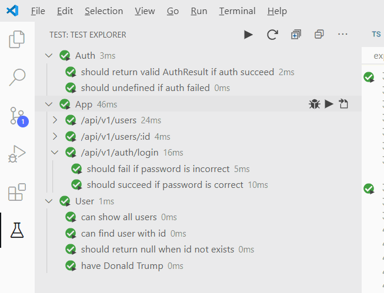

Demo Project of Node.js + Express + TypeScript + Mocha in VSCode
================================================================

This project is a minimal set of files which enables creating backend server with::

1. `Node.js`_  and `Express`_ - Popular backend solution.
#. `TypeScript`_ - A language extends from JavaScript. It adds a lot of essential features(such as strong type)
   for enterprise level projects.
#. `Mocha`_ - the fun, simple, flexible JavaScript test framework.
#. `Chai`_ - a BDD / TDD assertion library.

.. _Node.js: https://nodejs.org/en/
.. _Express: https://expressjs.com/
.. _TypeScript: https://www.typescriptlang.org/
.. _Mocha: https://mochajs.org/
.. _Chai: https://www.chaijs.com/

It's the result of my learning process.
I will try to explain every bits in the comments of the code.

It takes me some time to learn all the pieces.
But it's quite enjoyable when all things are in spin.
Now I can focus on coding & testing and the productivity is impressive.

It's not a trivial work to setup the project. So I created this project to show you the final result.
I learned it from:

* https://developer.okta.com/blog/2018/11/15/node-express-typescript
* https://groundberry.github.io/development/2016/12/10/testing-express-with-mocha-and-chai.html
* https://www.twilio.com/blog/2017/08/http-requests-in-node-js.html

Point of interest
-----------------

1. A comfortable VSCode developing environment.
2. Complete testing: unit test + web server test.

Prepare the Project
-------------------

1. Install Node.js
2. Install VSCode

   *  Install VSCode Extension: Mocha Test Explorer

#. Clone the project
   
   .. code-block:: bash
   
      $ git clone git@github.com:kingsimba/express-typescript-mocha-vscode.git

#. Install dependent node packages
   
   .. code-block:: bash
   
      $ cd express-typescript-mocha-vscode
      $ npm install

#. Open 'express-typescript-mocha-vscode.code-workspace' with VSCode

Start the Server
----------------

1. Press F5 to launch the server
2. Open browser and try the following URLS::

      GET http://localhost:8080
      GET http://localhost:8080/api/v1/users
      GET http://localhost:8080/api/v1/users/1
      GET http://localhost:8080/api/v1/users/999
      GET http://localhost:8080/api/v1/docs/sample.html
      POST http://localhost:8080/api/v1/auth/login?username=simba&password=mypassword
      POST http://localhost:8080/api/v1/auth/logout

3. Play with code

   The server will restart automatically when you save any file.
   But you need to refresh the page manually to see the new result.

Start Testing
-------------

There are 3 ways to run the tests.

1. Run from Test Explorer.

Optionally, enable "auto run" and modify any of the \*.spec.ts. When saved, the corresponding tests will run.

2. Click "run" or "debug" in the inlined code.

.. image:: images/inlined-test.png

3. Use "npm test"

.. code-block:: bash

   $ npm test    

   > express-typescript@1.0.0 test C:\Users\kingsimba\Documents\github\express-typescript-mocha-vscode
   > mocha src/**/*.ts --require='ts-node/register/transpile-only'

   server started at http://localhost:8080

   Auth
      √ should return valid AuthResult if auth succeed
      √ should undefined if auth failed

   App
      /api/v1/users
         √ return an array of users
      /api/v1/users/:id
         √ return 404 when the id is invalid
      /api/v1/auth/login
         √ should fail if password is incorrect
         √ should succeed if password is correct

   User
      √ can show all users
      √ can find user with id
      √ should return null when id not exists
      √ have Donald Trump

   10 passing (89ms)
